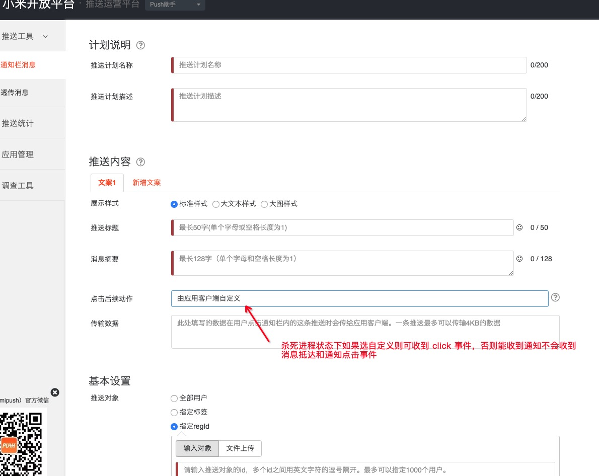
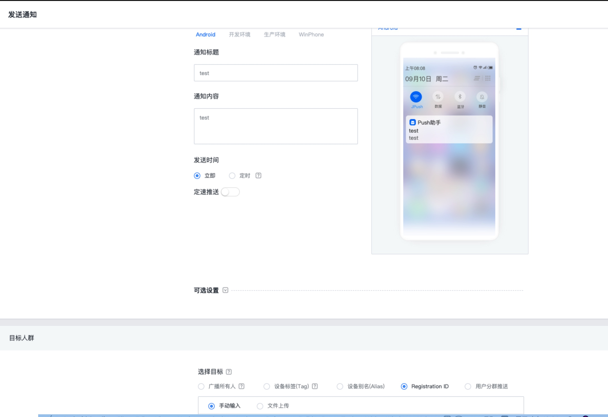

# Push
为解决 Android 推送碎片化、到达率低、集成繁琐等问题，聚合极光、小米、华为、Vivo等手机厂商提供的第三方推送


### 一 概述


> JLPush 目前聚合了极光、小米、华为三大平台的推送、其中小米、华为为厂商推送。Push 的启用默认逻辑是: 如果当前设备品牌是小米或者华为则走对应的厂商平台推送、其余设备机型启用极光推送。

​	 

- 小米 Push 所用版本 MiPush_SDK_Client_3_6_19.jar

- 华为 Push 所用版本 

  ```bash
   api 'com.huawei.android.hms:base:2.6.3.301'
   api 'com.huawei.android.hms:push:2.6.3.301'
  ```

- 极光 Push 所用版本

  ```bash
   api 'cn.jiguang.sdk:jpush:3.3.6'
   api 'cn.jiguang.sdk:jcore:2.1.6'
  ```

- minSdkVersion 16

### 二 流程


其中 App 应用层的职责是: 将 JLPush 库返回的 registerId 上报给自己的 App server ， App sever 能够通过各平台提供接口给 App 端下发通知。应用层需要处理 JLPush 聚合接口返回的通知做对应处理，例如: 弹出通知栏或者打开应用指定跳转界面。


### 三 名词解释

​		1 registerId : 各个推送平台客户端与推送服务端对应的秘钥，启动 App 调用初始化等接口时，如果初始化成功平台 SDK 应该会返回此值，某些平台也叫 token 一般拿到这个 registerId 去推送平台做接入调试或者上报给应用服务器。

​		2 通知栏与透传 : 受限于 Android 系统后台进程驻留机制，后台进程长时间保持存活越来越困难。推送厂商直接提供系统级别的推送来保证推送的到达率一般这样的推送方式称谓通知栏方式，特点是由系统保证推送到达率高，但是可自定义程度低，透传方式反之。

​		3 socket 长连接


### 四 集成准备

​      访问小米、华为、极光推送平台注册账号、随后创建应用。获取各个平台的 secret  appkey  appid 等重要数据


### 五 接入步骤


1. 依赖添加 : 

   ```bash
   implementation 'com.comjia:push:1.0'
   ```

   

   APP 的 build.gradle 的 buildTypes 中 新增华为和极光的(可选) 秘钥配置

   ```bash
               manifestPlaceholders = [
                       JPUSH_PKGNAME: 'com.comjia.push',
                       JPUSH_APPKEY : "your appkey", //JPush 上注册的包名对应的 Appkey.
                       JPUSH_CHANNEL: "developer-default", //暂时填写默认值即可.
                       
                       HUAWEI_APPID : "your appid"
               ]
   ```

   

2. 初始化:

   ​	在主进程建议在 application 中进行 push 库的初始化

   ```java
   PushConfig config = new PushConfig().configMiPush(MI_APP_ID, MI_APP_KEY);
   PushClient.init(this, config, new PushStatusListener() {
       @Override
       public void onRegister(String registerId, PushType pushType) {
           //TODO repoort or save registerId
       }
   
       @Override
       public void onError(String error, PushType pushType) {
   
       }
   
       @Override
       public void onPushConnected() {
   
       }
   });
   ```

   

   

3. 处理消息

   方式 1: 

   ​	自定义 class 继承  com.comjia.push.library.core.PushReceiver ，AndroidManifest.xml 对广播做做静态注册 如下:

   ​	

   ```bash
   <receiver
       android:name=".AppPushReceiver"
       android:exported="true">
       <intent-filter>
       <action android:name="com.comjia.push.intent.MESSAGE_ARRIVED" />
       <action android:name="com.comjia.push.intent.MESSAGE_CLICKED" />
       </intent-filter>
   </receiver>
   ```

   

   ```java
   public class AppPushReceiver extends PushReceiver {
   
       public static final String TAG = AppPushReceiver.class.getSimpleName();
   
       @Override
       public boolean onNotificationMessageArrived(Context context, PushType pushType, String notificationMessage) {
           Log.e(TAG, "onNotificationMessageArrived push type ：" + pushType + " message ：" + notificationMessage);
           return false;
       }
   
       @Override
       public boolean onNotificationMessageClicked(Context context, PushType pushType, String notificationMessage) {
           Log.e(TAG, "onNotificationMessageClicked push type ：" + pushType + " message ：" + notificationMessage);
           return false;
       }
   }
   ```

   

   ​	随后实现 PushReceiver 中的方法对通知的抵达以及点击状态等做处理

   

   方式 2 : 

   ```java
   PushClient.setOnPushActionListener(new OnPushActionListener() {
       @Override
       public void onNotificationReceived(String message, PushType pushType) {
   
       }
   
       @Override
       public void onNotificationOpened(String message, PushType pushType) {
   
       }
   
       @Override
       public void onTransparentMessage(String message, PushType pushType) {
   
       }
   });
   ```


### 六 API

TODO


### 七 测试

1 日志分析:

2 小米推送管理后台

http://admin.xmpush.xiaomi.com/ 



3 华为推送管理后台

4 极光推送管理后

[极光推送管理后台](https://www.jiguang.cn/jpush2/#/app/0dc337f2661e3264374bcd05/push_form/notification)




### 八 FQA

1. Q: 应用在小米手机上进程存活和不存活时候接受推送是什么表现？

   A: 进程是否存活小米通知都能收到，只是代码中小米 SDK 广播收到的事件不一样。如果是进程存活小米推送的表现是抵达事件和点击通知栏事件都能收到，如果进程被杀死则(点击通知自定义)的推送收不到抵达事件能收到点击的事件，此时应用会走 application 的 oncreate 方法但是主界面不会被唤起需要开发者自己去处理唤起 splash 或者 main 页面的唤起。

2. Q: 极光推送在进程存活和不存活时候接受推送是什么表现？

   A: 极光推送进程存活消息抵达和通知事件都能收到，进程被杀死后均无法收到推送。  

### 九 Branch & Tag

- 2019 年 11 月 华为由 Hms 2.x  版本全面升级 Hms 3.x ，集成和接入方式以及文档完全变更。为此 JLPush 库同步开发 Hms 3.x ，详见分支 [hms_version_3](https://github.com/13120241790/Push/tree/hms_version_3) 。


未完待续...