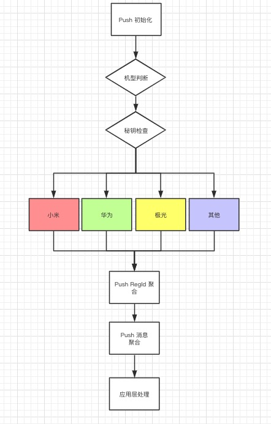

# Push
为解决 Android 推送碎片化、到达率低、集成繁琐等问题，聚合极光、小米、华为、Vivo等手机厂商提供的第三方推送


### 一 概述


> JLPush 目前聚合了极光、小米、华为三大平台的推送、其中小米、华为为厂商推送。Push 的启用默认逻辑是: 如果当前设备品牌是小米或者华为则走对应的厂商平台推送、其余设备机型启用极光推送。

​	 

- 小米 Push 所用版本 MiPush_SDK_Client_3_6_19.jar

- 华为 Push 所用版本 

  ```bash
   api 'com.huawei.android.hms:base:2.6.3.301'
   api 'com.huawei.android.hms:push:2.6.3.301'
  ```

- 极光 Push 所用版本

  ```bash
   api 'cn.jiguang.sdk:jpush:3.3.6'
   api 'cn.jiguang.sdk:jcore:2.1.6'
  ```

- Min

### 二 流程





其中 App 应用层的职责是: 将 JLPush 库返回的 registerId 上报给自己的 App server , App sever 能够通过各平台提供接口给 App 端下发通知。应用层需要处理 JLPush 聚合接口返回的通知做对应处理，例如: 弹出通知栏或者打开应用指定跳转界面


### 三 名词解释

​		1 registerId : TODO

​		2 通知栏与透传 : TODO


### 四 集成准备

​      TODO


### 五 接入步骤


1. 依赖添加 : TODO

2. 初始化:

   ​	在主进程建议在 application 中进行 push 库的初始化

   ```java
   PushConfig config = new PushConfig().configMiPush(MI_APP_ID, MI_APP_KEY);
   PushClient.init(this, config, new PushStatusListener() {
       @Override
       public void onRegister(String registerId, PushType pushType) {
           //TODO repoort or save registerId
       }
   
       @Override
       public void onError(String error, PushType pushType) {
   
       }
   
       @Override
       public void onPushConnected() {
   
       }
   });
   ```

   

   

3.  处理消息

   方式 1 : 

   ```java
   PushClient.setOnPushActionListener(new OnPushActionListener() {
       @Override
       public void onNotificationReceived(String message, PushType pushType) {
   
       }
   
       @Override
       public void onNotificationOpened(String message, PushType pushType) {
   
       }
   
       @Override
       public void onTransparentMessage(String message, PushType pushType) {
   
       }
   });
   ```


​	方式 2 : 广播接收 TODO 


### 六 API

TODO


### 七 测试

1 日志分析:

2 小米推送管理后台

3 华为推送管理后台

4 极光推送管理后

TODO	


### 八 FQA

TODO


### 九 Branch & Tag

- 2019 年 11 月 华为由 Hms 2.x  版本全面升级 Hms 3.x 。集成和接入方式以及文档完全变更。为此 JLPush 库同步开发 Hms 3.x ，详见分支 [hms_version_3](https://github.com/13120241790/Push/tree/hms_version_3) 


未完待续...